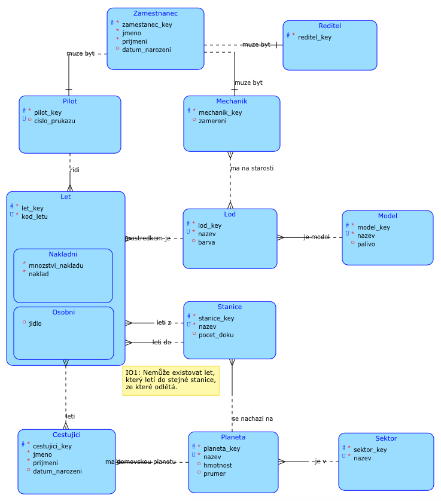

# Vesmírná dopravní společnost (VDS)

## Popis

Doba pokročila. Už nežijeme pouze na Zemi, ale obýváme nemalou část známého vesmíru. Z tohoto důvodu je potřeba, aby se někdo postaral o převoz lidí, nebo jakéhokoliv nákladu mezi planetami. A tím "někdo", je právě VDS, neboli Vesmírná dopravní společnost.

Společnost VDS poskytuje dva různé druhy přepravy. Osobní a nákladní. Osobním rozumíme přepravu jakéhokoliv lidského nákladu. Lety bez lidského nákladu (nepočítáme-li přitomnost pilota a personálu) nazýváme nákladní. Společnost vede databázi o obou druzích. Každý let má u sebe uveden svůj unikátní kód, druh, loď, svého pilota, odkud a na jakou vesmírnou stanici letí a v neposlední řadě cestující (v případě delšího letu je zajištěna strava) nebo náklad a jeho množství (záleží na druhu). Společnost je čistě přepravní, neposkytuje vyhlídkové lety, tudíž lodě nelétají do stejné stanice ze které vylétají.

Společnost samozřejmě vede evidenci o svých cestujících. Každý cestující má u sebe uvedené jméno, příjmení, pohlaví a domovskou planetu, popřípadě datum narození.

Letá se tedy od a do vesmírných stanic, která mají svá unikátní jména. Některá mají uvedenou informaci o počtu doků. Každá stanice patří k nějaké planetě, které mají odlišné vlastnosti. Planety se pak začleňují do tzn. vesmírných sektorů. Lodě mají taktéž své unikátní jména (neexistují dvě různé lodě se stejným jménem), je uvedeno o který typ/model lodě se jedná a může být udána i barva. Loď může, ale i nemusí mít svého mechanika/y. Různé typy/modely mají různé vlastnosti, například spotřebovávají jiný druh paliva.

Společnost rozhodně není malá a má spoustu zaměstnanců. Proto si společnost vede databázi svých zaměstnanců. Zaměstnanci mají u sebe uvedeno svoje ID, jméno a svoji pozici. Zaměstanec může být mechanikem, pilotem nebo ředitelem nebo může zastávat více pozic najednou.

## Konceptuální schéma



## Smyčky

1) Zamestnanec - Pilot - Let - Lod - Mechanik - Zamestnanec
>Tato smyčka nedělá problém, zaměstanec může zaujímat více rolí, může napříklat pilotovat loď, které je i sám mechanikem.

2,3) Let (Osobni) - Stanice - Planeta - Cestujici - Let (Osobni)
>Cestující může letat ze své nebo do své domovské planety. Smyčky nečiní problém.

4) Stanice - Let - Stanice
>Společnost VDS neposkytuje vyhlídkové lety, čili let, který letí do stejné stanice odku vylétá, není povolen. Smyčka nedělá problém.

## Relační schéma


## Dotazy

1. <a name="D1"></a>Seznam planet v sektoru 'delta'.
```
{PLANETA<*SEKTOR(nazev='delta')[sektor_key]}[nazev]
```
```sql
select planeta.nazev
from planeta join sektor on (planeta.sektor_key = sektor.sektor_key)
where sektor.nazev = 'delta';
```
2. Seznam kódů nákladních letů, kterých se neúčastnily modré, červené a žluté lodě.
```
{NAKLADNI!<*LOD(barva='modrá'∨barva='červená'∨barva='žlutá')}[kod_letu]
```
```sql
(select kod_letu
from nakladni natural join lod)
minus
((select kod_letu
from nakladni natural join lod
where barva='modrá')
union
(select kod_letu
from nakladni natural join lod
where barva='červená')
union
(select kod_letu
from nakladni natural join lod
where barva='žlutá'))
```
3. Seznam pilotů, kteří pilotovali pouze nákladní lety ze stanice 'PPH-734'.
```
{{ZAMESTNANEC*PILOT*NAKLADNI[pilot_key, nakladni_key,  z_stanice_key][z_stanice_key=stanice_key]STANICE(nazev='PPH-734')}[zamestnanec_key,prijmeni, jmeno]}
\
{{ZAMESTNANEC*PILOT*NAKLADNI[pilot_key, nakladni_key,  z_stanice_key][z_stanice_key=stanice_key]STANICE(nazev!='PPH-734')}[zamestnanec_key,prijmeni, jmeno]}
```
```sql
(select distinct zamestnanec.zamestnanec_key, prijmeni, jmeno
from zamestnanec join pilot on (zamestnanec.zamestnanec_key = pilot.zamestnanec_key)
                    join nakladni using (pilot_key)
                    join stanice on (z_stanice_key = stanice_key)
where nazev = 'PPH-734')
minus
(select distinct zamestnanec.zamestnanec_key, prijmeni, jmeno
from zamestnanec join pilot on (zamestnanec.zamestnanec_key = pilot.zamestnanec_key)
                    join nakladni using (pilot_key)
                    join stanice on (z_stanice_key = stanice_key)
where nazev != 'PPH-734');
```
4. Seznam cestujících, kteří letěli do každého sektoru.
```sql
create view cestoval_do_kazdeho_sektoru as
select cestujici_key
from (select cestujici_key, cestujici.prijmeni, cestujici.jmeno, nazev
from (select distinct cestujici_key, sektor.nazev
          from let_cestujiciho join osobni using (osobni_key)
                               join stanice on (do_stanice_key=stanice_key)
                               join planeta using (planeta_key)
                               join sektor using (sektor_key))
          natural join cestujici
order by cestujici_key)
group by cestujici_key
having count(*) = (select count(*) from sektor)
order by cestujici_key;
select prijmeni, jmeno from cestoval_do_kazdeho_sektoru natural join cestujici;
drop view cestoval_do_kazdeho_sektoru;
```
5. Ověření dotazu číslo 4 - Seznam všech sektorů mínus seznam sektorů, které jsou výstupem dotazu číslo 4, musí být prázdná množina.
```sql
(select sektor_key from sektor)
minus
(select sektor_key
from (select cestujici_key
          from (select cestujici_key, cestujici.prijmeni, cestujici.jmeno, nazev
            from (select distinct cestujici_key, sektor.nazev
              from let_cestujiciho join osobni using (osobni_key)
                                   join stanice on (do_stanice_key=stanice_key)
                                   join planeta using (planeta_key)
                                   join sektor using (sektor_key))
            natural join cestujici
           order by cestujici_key)
    group by cestujici_key
    having count(*) = (select count(*) from sektor)
    order by cestujici_key) natural join let_cestujiciho
                            join osobni using (osobni_key)
                            join stanice on (do_stanice_key=stanice_key)
                            join planeta using (planeta_key)
                            join sektor using (sektor_key));
```
6. Seznam sektorů, mající více jak 3 planety s hmotností větší než 300 000.
```sql
select sektor.nazev
from sektor join planeta on (sektor.sektor_key = planeta.sektor_key)
where planeta.hmotnost > 300000
group by sektor.sektor_key, sektor.nazev
having count(*) > 3
order by count(*) asc;
```
7. Všechny možné kombinace planet a sektorů.
```
{planeta[nazev→nazev_planety]×sektor[nazev→nazev_sektoru]}
```
```sql
select *
from (select nazev as nazev_planety from planeta) cross join (select nazev as nazev_sektoru from sektor);
```
8. Lodě, které nemají ani jednoho mechanika.
```sql
-- Varianta 1
select nazev
from lod left join starost_o_lod on lod.lod_key = starost_o_lod.lod_key
where starost_o_lod.mechanik_key is null;
-- Varianta 2
select nazev
from lod join (select lod_key from lod minus select lod_key from starost_o_lod) using (lod_key);
-- Varianta 3       
select nazev
from lod
where lod_key not in (select lod_key from starost_o_lod);
```
9. Počet lodí modelu 'NA-02'.
```sql
select count(*)
from lod join model on (lod.model_key = model.model_key)
where model.nazev = 'NA-02';
```
10. Jména pilotů, kteří pilotovali alespoň jeden nákladní a jeden osobní let.
```
{{{{PILOT*OSOBNI}[zamestnanec_key]}∩{{PILOT*NAKLADNI}[zamestnanec_key]}}*>ZAMESTNANEC}[prijmeni, jmeno]
```
```sql
(select prijmeni, jmeno
from (select distinct zamestnanec_key
          from pilot join osobni using (zamestnanec_key))
          natural join zamestnanec)
intersect
(select prijmeni, jmeno
          from (select distinct zamestnanec_key
          from pilot join nakladni using (zamestnanec_key))
          natural join zamestnanec);
```
11. Počet zaměstanců zastávajících funkce pilot, mechanik a ředitel zároveň.
```sql
select count(*)
from zamestnanec join (select zamestnanec_key as zamestnanec_klic
                           from mechanik natural join pilot natural join reditel)
                           on (zamestnanec_key = zamestnanec_klic);
```
12. Lodě, které používají 'dusík' jako palivo.
```
{LOD[nazev, model_key]*MODEL[palivo, model_key]}(palivo='dusík')[nazev]
```
```sql
select nazev
from lod
where exists (select 1 from model where palivo = 'dusík' and lod.model_key = model_key);
```
13. Přidej všechny ředitele do tabulky cestující a nastav jejich domovskou planetu na 'Korhal'.
```sql
insert into cestujici (cestujici_key, jmeno, prijmeni, datum_narozeni, planeta_key)
select cestujici_seq.nextval, jmeno, prijmeni, datum_narozeni, (select planeta_key from planeta where nazev = 'Korhal')
from zamestnanec natural join reditel;
rollback;
```
14. Všem planetám v sektoru 'beta' odstraň záznam o jejich hmotnosti (nastav na null).
```sql
update planeta set hmotnost = NULL
where planeta_key in (select planeta_key
                          from planeta join sektor on (planeta.sektor_key = sektor.sektor_key) and sektor.nazev = 'beta');
rollback;
```
15. Seznam lodí a jejich mechaniků, včetně lodí, které mechaniky nemají, seřazené podle názvu lodi.
```sql
select distinct nazev, prijmeni, jmeno
from lod full join starost_o_lod using (lod_key)
                  left join mechanik on (starost_o_lod.zamestnanec_key = mechanik.zamestnanec_key)
                  left join zamestnanec on (mechanik.zamestnanec_key = zamestnanec.zamestnanec_key)
order by nazev;
```
16. Smaž cestujícímu jménem 'Bronislav Pokuta' účast na všech letech.
```sql
delete from let_cestujiciho
where cestujici_key in (select cestujici_key from cestujici where jmeno='Bronislav' and prijmeni='Pokuta');
rollback;
```
17. Cestující, kteří letěli na svou domovskou planetu.
```sql
select distinct prijmeni, jmeno
from cestujici natural join let_cestujiciho
                   natural join osobni
                   join stanice on (do_stanice_key=stanice_key)
where cestujici.planeta_key = stanice.planeta_key
order by prijmeni, jmeno;
```
18. Cestující s domovskou planetou v sektoru omega, kteří se narodili po roce 1990.
```
{{SEKTOR(nazev='omega')[sektor_key]}*PLANETA*CESTUJICI(datum_narozeni>'1.1.1990')}[prijmeni, jmeno]
```
```sql
select prijmeni, jmeno
from sektor join (select planeta_key, sektor_key from planeta) using (sektor_key)
                natural join cestujici
where datum_narozeni > '1.1.1990' and nazev = 'omega';
```
19. Mechanici starající se o tyrkysové nebo žluté lodě.
```
{LOD(barva='šedá'∨barva='žlutá')*STAROST_O_LOD[zamestnanec_key, lod_key]*MECHANIK[zamestnanec_key]*ZAMESTNANEC}[prijmeni, jmeno]
```
```sql
select distinct prijmeni, jmeno
from (select lod_key from lod where barva = 'šedá' or barva = 'žlutá')
          natural join starost_o_lod
          join mechanik using (zamestnanec_key)
          join zamestnanec using (zamestnanec_key);
```
20. Stanice mimo sektor 'alpha'.
```
{STANICE*PLANETA[planeta_key, sektor_key]<*SEKTOR(nazev!='alpha')[sektor_key]}[nazev]
```
```sql
select nazev
from stanice natural join (select planeta_key, sektor_key from planeta)
                 natural join (select sektor_key from sektor where nazev != 'alpha');
```
21. Cestující, kteří letěli v letech, kde se podávaly 'palačinky'.
```
{CESTUJICI*LET_CESTUJICIHO*OSOBNI(jidlo='palačinky')}[prijmeni, jmeno]
```
```sql
select distinct prijmeni, jmeno
from cestujici natural join let_cestujiciho natural join osobni
where jidlo = 'palačinky';
```
22. Planety, ve kterých jsou pouze stanice, které mají více než 7 doků.
```sql
(select distinct planeta.nazev
from planeta join stanice on (planeta.planeta_key = stanice.planeta_key)
where pocet_doku > 7)
minus
(select distinct planeta.nazev
from planeta join stanice on (planeta.planeta_key = stanice.planeta_key)
where pocet_doku <= 7 or pocet_doku is null);
```
23. Celkové mnozství převezených automobilů lodí 'Remorseless'.
```sql
select sum(mnozstvi_nakladu) from nakladni natural join lod
where naklad = 'automobily' and nazev = 'Remorseless';
```
24. Celkový počet letů lodi 'Untouchable'.
```sql
create view pocet_nakladnich_letu as
(select count(*) pocet from nakladni natural join lod where nazev = 'Untouchable');
create view pocet_osobnich_letu as
(select count(*) pocet from osobni natural join lod where nazev = 'Untouchable');
select sum((select pocet from pocet_nakladnich_letu) + (select pocet from pocet_osobnich_letu)) celkovy_pocet from dual;
drop view pocet_nakladnich_letu;
drop view pocet_osobnich_letu;
```
25. Planeta v sektoru 'lambda' s největší hmotností.
```sql
select nazev from planeta
where hmotnost = (select max(hmotnost)
from planeta join sektor on (planeta.sektor_key = sektor.sektor_key) where hmotnost is not null and sektor.nazev = 'lambda');
```

## Tabulka pokrytí kategorií SQL příkazů

| Kategorie     | Pokrývá           | Popis kategorie |
|:-------------:|:-----------------:| :-----|
| A             |[D1], D2, D4, D5, D6, D9, D10, D11, D13, D14, D15, D17, D18, D19, D21, D22, D23, D24, D25| A - Pozitivní dotaz nad spojením alespoň dvou tabulek |
| B             |D2, D20            | B - Negativní dotaz nad spojením alespoň dvou tabulek |
| C             |D3, D22            | C - Vyber ty, kteří mají vztah POUZE k ... |
| D1            |D4                 | D1 - Vyber ty, kteří/které jsou ve vztahu se všemi - dotaz s univerzální kvantifikací |
| D2            |D5                 | D2 - Kontrola výsledku dotazu z kategorie D1 |
| F1            |D1, D3, D4, D5, D6, D9, D11, D14, D17, D22, D25| F1 - JOIN ON |
| F2            |D2, D3, D4, D5, D8, D10, D11, D13, D15, D17, D18, D19, D20, D21, D23, D24| F2 - NATURAL JOIN, JOIN USING |
| F3            |D7                 | F3 - CROSS JOIN |
| F4            |D8, D15            | F4 - LEFT, RIGHT OUTER JOIN |
| F5            |D15                | F5 - FULL (OUTER) JOIN |
| G1            |D8, D12, D14, D16, D25| G1 - Vnořený dotaz v klauzuli WHERE |
| G2            |D4, D5, D8, D10, D11, D18, D19| G2 - Vnořený dotaz v klauzuli FROM |
| G3            |D7, D13            | G3 - Vnořený dotaz v klauzuli SELECT |
| G4            |D12                | G4 - Vztažený vnořený dotaz (EXISTS, NOT EXISTS) |
| H1            |D2                 | H1 - Množinové sjednocení - UNION |
| H2            |D2, D3, D5, D8, D22| H2 - Množinový rozdíl - MINUS (v Oracle) |
| H3            |D10                | H3 - Množinový průnik - INTERSECT |
| I1            |D4, D5, D6, D9, D11, D23, D24, D25| I1 - Agregační funkce (count,sum,min,max,avg) |
| I2            |D4, D5, D6         | I2 - Agregační funkce nad seskupenými řádky - GROUP BY (HAVING) |
| J             |D8                 | J - Stejný dotaz ve třech různých formulacích SQL |
| K             |D6                 | K - Všechny klauzule v 1 dotazu - SELECT FROM WHERE GROUP BY HAVING ORDER BY |
| L             |D4, D24            | L - VIEW |
| M             |D4                 | M - Dotaz nad pohledem |
| N             |D13                | N - INSERT, který vloží do některé tabulky množinu řádků, které jsou vybrány dotazem z vybraných tabulek (příkaz INSERT, ve kterém je klauzule VALUES nahrazena vnořeným poddotazem. |
| O             |D14                | O - UPDATE s vnořeným SELECT příkazem |
| P             |D16                | P - DELETE s vnořeným SELECT příkazem |

## Skripty a modely

Create script - [create.sql]</br>
Insert script - [insert.sql]</br>
SQL Developer - [sqldev-sources.zip]

## Závěr

Ze začátku jsem měl dilema ohledně tématu své semestrální práce. Protože mám rád vesmír, zvolil jsem si nakonec vesmírnou dopravní společnost. Vymyslet popis byla záležitost na pár hodin a navíc jsem si oprášil český jazyk ze střední školy. Co se týče konceptuálního modelu, stačilo se opravdu jen trochu zamyslet a využít znalostí z přednášek a proseminářů. Před testem jsem SQL moc neuměl, naučil jsem se ho pořádně až při tvoření dotazů pro třetí kontrolní bod. Když jsem se blížil k závěru, měl jsem celkem problém s vymýšlením posledních dotazů. Semestrální práce pro mě byla skvělou přiležitostí naučit se pracovat s vlastní databází, s čímž jsem doposud moc zkušeností neměl.

## Zdroje

[1] Stránky předmětu BI-DBS - https://edux.fit.cvut.cz/courses/BI-DBS</br>
[2] Nová verze "vzorové" semestrální práce umístěná na adrese: https://users.fit.cvut.cz/~hunkajir/dbs/main.xml</br>
[3] Generátor dat - https://www.generujdata.cz</br>

 [D1]: #D1
 [create.sql]: scripts/create.sql
 [insert.sql]: scripts/insert.sql
 [sqldev-sources.zip]: sqldev/sqldev-sources.zip
 [litvaluk@fit.cvut.cz]: litvaluk@fit.cvut.cz